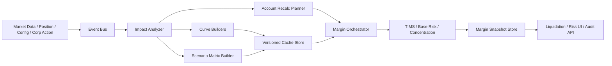
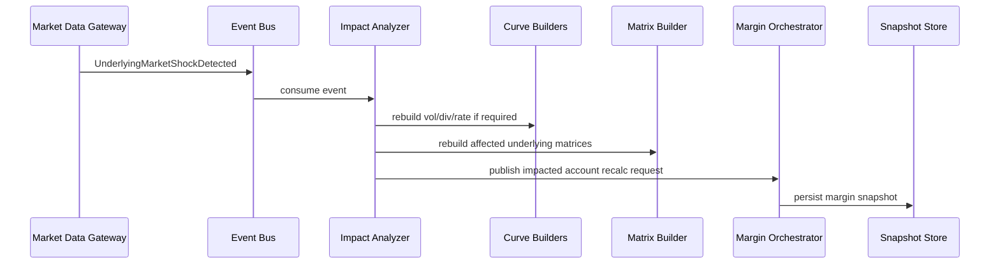
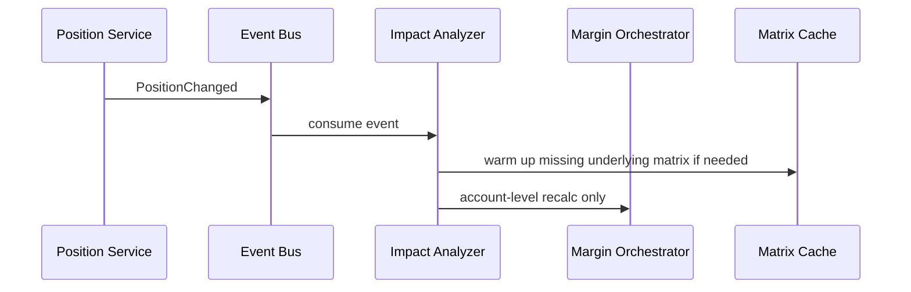
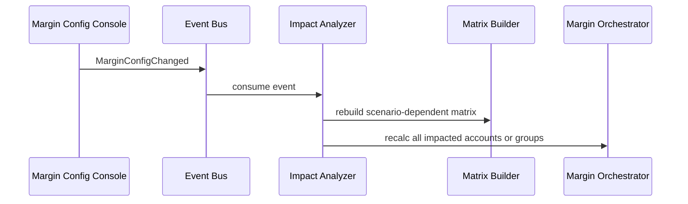

# 系统总体架构

## 1. 业务目标

系统要解决的不只是“算一次保证金”，而是持续、稳定、低延迟地回答以下问题：

- 这个账户此刻的最终保证金是多少？
- 保证金由哪种风险算法主导？
- 某个市场事件到来后，哪些曲线和缓存需要重建？
- 哪些账户需要立刻重算，用于预警或砍仓？
- 这份保证金快照对应的市场数据、配置和曲线版本是什么？

## 2. 核心对象

### 2.1 风险算法层

- `TIMS`
  - 对每个 `symbol` 构造 10 个等距价格场景。
  - 基于定价系统得到每个场景下的盈亏。
  - 按 `Class Group -> Product Group -> Portfolio Group` 三层聚合与对冲。
  - 在 10 个场景中取最大损失。
- `Base Risk`
  - 在价格与波动率二维场景下定价。
  - 同样支持类组、产品组、投资组合组对冲。
  - 对波动率形态变化更加敏感。
- `Concentration Risk`
  - 关注单名或少数仓位在极端涨跌和波动率跳变下的损失集中。
  - 每个 `underlying` 的价格/波动率冲击由业务配置。
- `Aggregator`
  - 取各风险算法结果的最大值，形成最终保证金。

### 2.2 基础定价依赖层

- `Spot / Futures Price`
- `Volatility Surface`
- `Dividend Curve`
- `Rate Curve`
- `Corporate Action Rules`
- `Scenario Set / Margin Config / Offset Rules`

### 2.3 缓存层

- `Curve Cache`
  - 波动率曲面、股息曲线、利率曲线
- `Price/Vol Matrix Cache`
  - 按 `underlying + scenario family + version bundle` 组织
- `Contract Price Cache`
  - 针对高频合约做精细化缓存
- `Account Margin Snapshot Cache`
  - 用于风控查询、预警、砍仓

## 3. 推荐系统分层

## 4. 服务职责建议

### 4.1 Event Bus

建议使用 `Kafka` 或 `Pulsar`，至少拆成以下主题：

- `market-events`
- `reference-events`
- `position-events`
- `margin-recalc-requests`
- `margin-snapshots`
- `liquidation-alerts`

### 4.2 Impact Analyzer

负责把“发生了什么”翻译成“哪些东西要重算”：

- 判断事件范围：全市场、单个 `underlying`、某批账户
- 判断事件严重性：`P0 / P1 / P2`
- 决定需要重建哪些依赖：
  - 曲线
  - 矩阵
  - 账户保证金
  - 快照

### 4.3 Curve Builders

- `Vol Surface Builder`
- `Dividend Curve Builder`
- `Rate Curve Builder`

这些服务必须输出版本号，并且支持幂等重试。

### 4.4 Scenario Matrix Builder

负责构造与刷新价格/波动率缓存矩阵，供 TIMS、Base Risk、Concentration Risk 复用。

### 4.5 Margin Orchestrator

负责编排依赖执行顺序：

1. 等待底层曲线和矩阵可用
2. 查询受影响账户清单
3. 调用保证金算法
4. 产出快照
5. 若超过阈值，则向砍仓模块发消息

## 5. 调用链路设计

### 5.1 市场重大变动

### 5.2 持仓新增/平仓

### 5.3 配置变更

## 6. 版本化原则

每一份保证金快照都必须可回溯到如下版本：

- `market_data_version`
- `vol_surface_version`
- `dividend_curve_version`
- `rate_curve_version`
- `scenario_set_version`
- `margin_rule_version`
- `pricing_model_version`

如果快照无法绑定这些版本，后续将很难解释：

- 为什么这次保证金跳变了
- 是市场变了还是参数变了
- 某个客户被砍仓时所依据的版本是什么

## 7. 高可用与风控兜底

### 7.1 幂等

所有重算任务都应带：

- `event_id`
- `version_bundle`
- `recalc_scope`
- `dedupe_key`

重复消费不得生成冲突快照。

### 7.2 降级

当矩阵尚未刷新完时：

- 普通查询可以返回“上一个一致性快照 + stale 标识”
- 砍仓判断可以使用“上一个快照 + 保守附加项”
- 后台继续补算最新版本

### 7.3 事件合并

市场事件不能对每一次 tick 都立刻全量重算，建议：

- 小波动：按 `underlying` 做毫秒级或秒级合并
- 大波动：直接升级为高优先级事件
- 配置事件：严格串行化，不与旧版本并发混算
